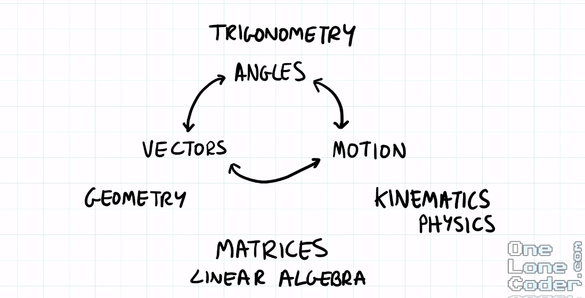
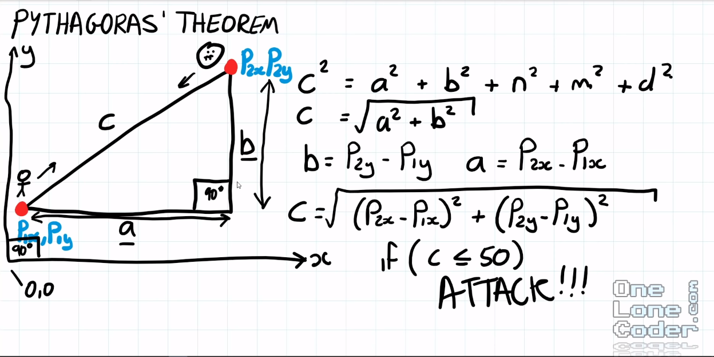
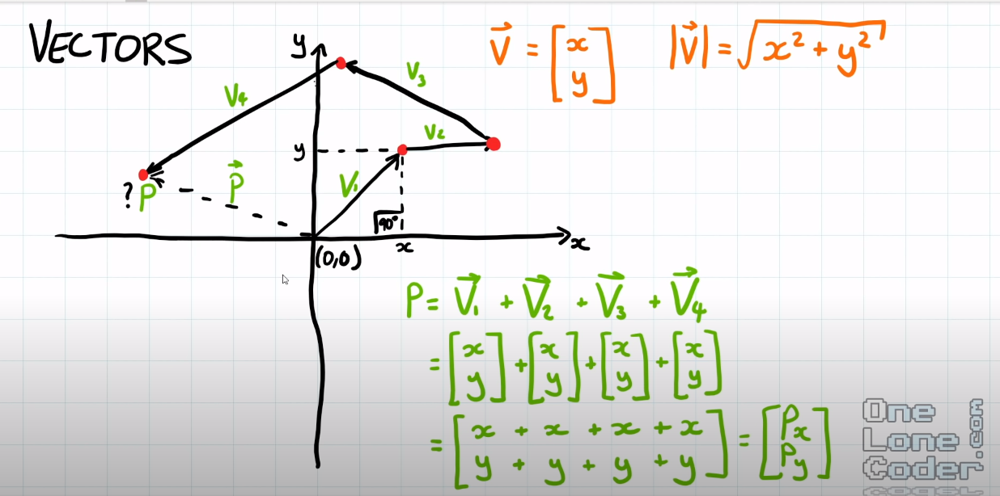
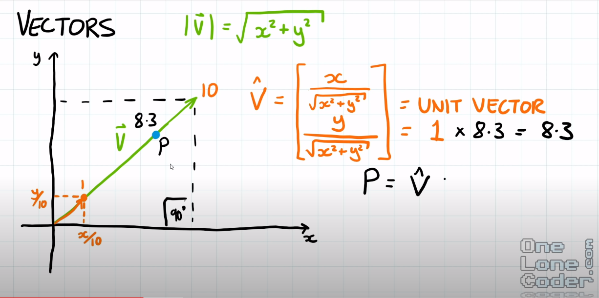
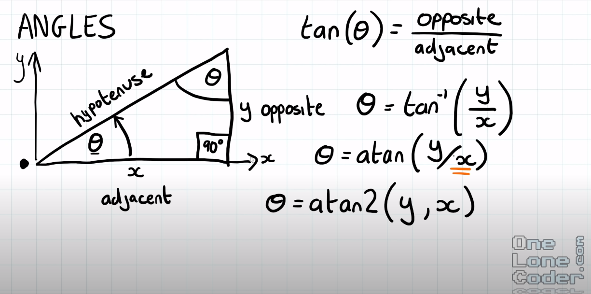
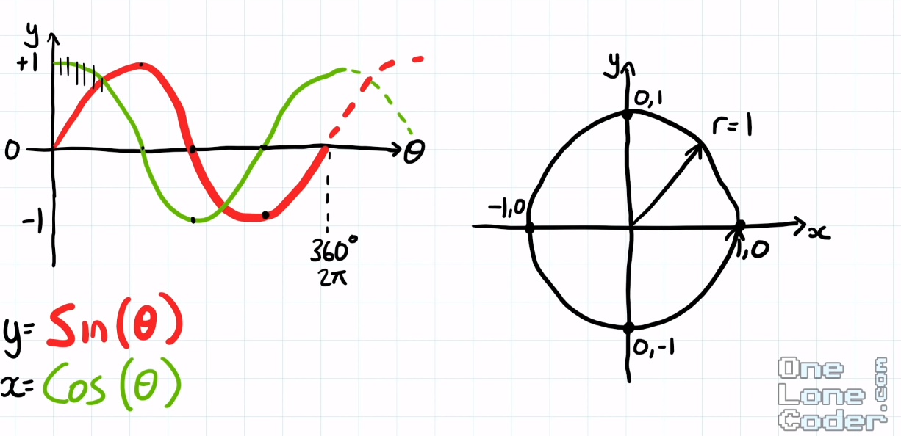
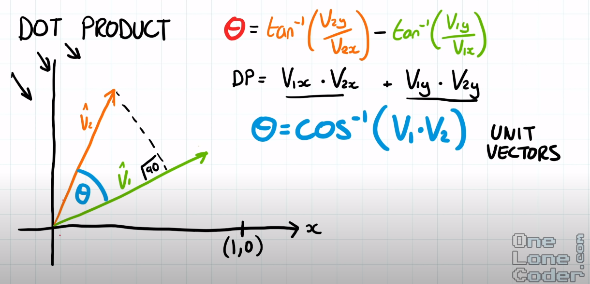
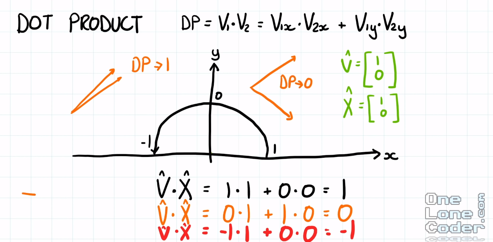

# Matemática aplicada para jogos

Matématica é uma ferramenta muito importante quando estamos pensando em criar jogos, todas as interações, manipulação do espaço seja ele em 2D ou 3D, animação, é controlador por várias funções matemáticas.

Basicamente no desenvolvimento de software conseguimos fazer grande parte das funcionalidades aplicando alguns conceitos simples:
 - Ângulos
 - Vetores
 - Movimento (Interpolação)
 - Matrizes



Essa imagem retrata bem a relação entre todos esse conceitos e a ideia por trás esses conceitos serão amplamente utilizados.

# Pythagoras' Theorem (Teorema de pitágoras)

Teorema de pitágoras relaciona os lados de um triângulo retângulo. Utilizando o teorema de pitágoras, podemos definir as distâncias entre objetos em uma cena.

Pela definição o teorema de pitágora:

```
c^2 = a^2 + b^2
ou
c = sqrt(a^2 + b^2)
```

Na imagem abaixo segue o exemplo da distância euclidiana entre um jogador representado pelo ponto *(Px1, Py1)* e o inimigo representado por *(Px2, Py2)*.



Sabemos que a distância entre dois pontos num espaço 2D é calculado por, `d = X2 - X1`, podemos aplicar para descobrir os pontos *a* e *b* do teorema:

```
a = Px2(inimigo) - Px1(jogador)
b = Py2(inimigo) - Py1(jogador)
```

Pela definição e aplicando ao problema da distância do inimigo, temos:

```
c = sqrt((Px2 - Px1)^2 + (Py2 - Py1)^2)
```

# Vectors

Vetores são importantes porque eles determinam tamanho (maginetude), direção e sentido.

Vetores podem ser somados ou subtraidos, assim sabemos o vetor resultante dada essas operações entre vetores.



Um caso interessante para o uso de vetores é saber o vetor resultando de um player, dado vários movimentos no espaço 2 D. O vetor resutando é determinado pela soma dos vetores components.

Podemos utilizar apenas a direção e o sentido de um vetor, esses vetores são chamados de **vetores unitários (unit vectors)**, podem ser determinados pelo método de normalização.

Os vetores unitários são muito utilizados principalmente para simplificar as operações. São uma ótima forma de navegar o espaço do jogo, já que a distância vira apenas um escalar separado do conceito de direção que o objeto tem durante o percurso.



# Angles (Ângulos)



Cálculo dos ângulos em um triângulo retângulo se dá por:

```
degree_THETA = sin(O / H)
degree_THETA = cos(H / O)
degree_THETA = tan^-1(O / A)
```

A maioria das linguagens de progração utilizam **Radius (Radianos)** como medição dos ângulos. Sabemos que existe uma relação linear entre ângulos e radianos.

```
radians = degrees / 180 * PI
or
degrees = radians / PI * 180
```

## Sin e Cos

Senos e Cossenos são funções importantes para fazer a relação entre angulos em um espaço 2D ou 3D.



Pense que temos uma nave espacial que rotaciona em relação a origem, podemos determinar sua rotação em termos de senos e cossenos para saber onde a nave está rotacionada no espaço do jogo.

Funções como `sin, cos, tan, sqrt` são consideradas funções computacionalmente pesadas, precisando de muitos ciclos para concluir apenas uma operação. Assim pode ser mais performático trabalhar com vetores para os cálculos.

## DOT Product (Produto escalar)

Digamos que queremos saber o ângulos entre dois vetores, uma das otimizações que podemos fazer é utilizar vetores unitários, dessa forma não é necessário calcular o tamanho dos vetores.



Dessa forma o produto escalar entre dois vetores é a multiplicação entre os dois

```
DP = Vx1 * Vx2 + Vy1 * Vy2
```

Outra propriedade que podemos tirar do produto escalar é:

- vetores concorrentes(paralelos): **DP = 1**
- vetores perpendiculares: **DP = 0**
- vetores opostos: **DP = 1**



Uma forma de utilizar o produto escalar pode ser na representação da velocidade do personagem quando este está descendo ou subindo uma área inclinada. Dado o produto escalar podemos aumentar a velocidade do jogador em caso de descida ou diminiuir em caso de subida.


# Linear Interpolation

Dados dois valores, pontos no espaço 2D ou 3D, vetores, vetores multidimensionais, podemos calcular qualquer valor entre esses dois valores.


Assim para uma função linear temos a seguinte definição de interpolação:

```
N_t = N_start + (N_end - N_start) * t
```
onde,
 - N_t é um valor intermediário
 - N_start o valor inicial
 - N_end o valor final
 - t a proporção entre os pontos finais e iniciais calculados

A interpolação linear é muito utilizada quando precisamos aproximar um comportamento de uma função complexa que não tem uma definição direta. Assim utilizamos interpolação linear para aproximar pedaços dessa função complexa em partes lineares.

# Bibliografia

- [Essential Mathematics For Aspiring Game Developers](https://www.youtube.com/watch?v=DPfxjQ6sqrc&list=PLK9v9ebk627fEHJOVLR0xku-iYenE8m8X&index=11)