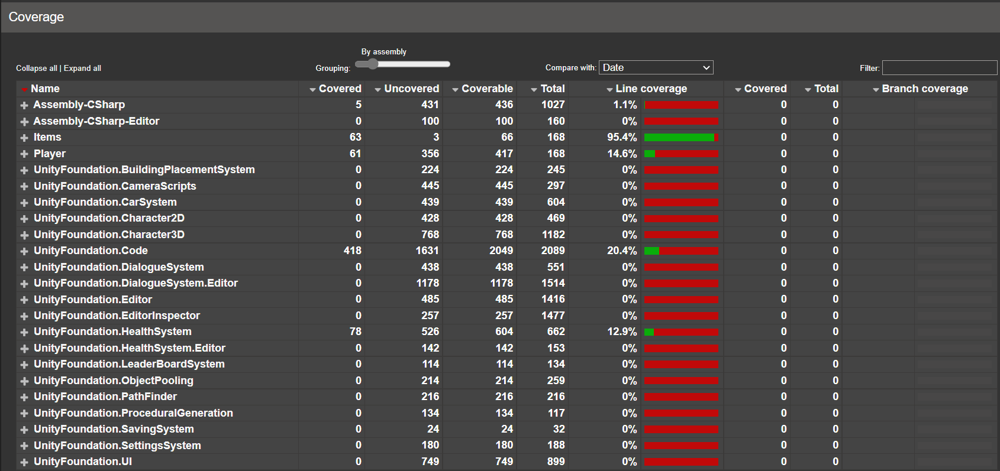
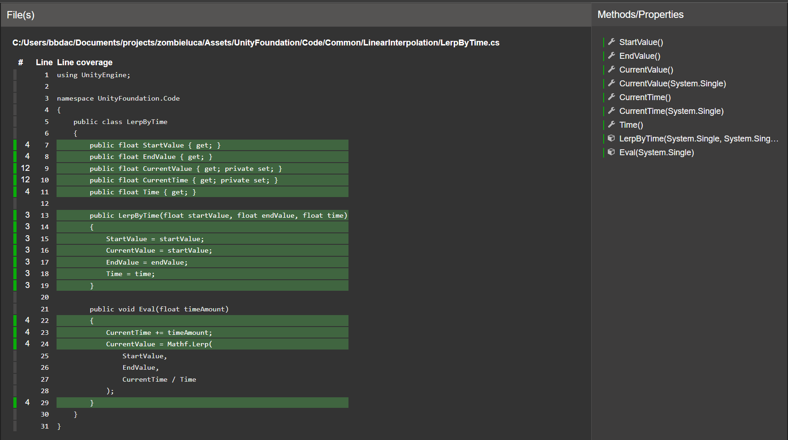

# Testes automatizados

> Testes automatizados são qualquer tipo de teste escritos para testar automaticamente um sistema.

## Por que utilizar testes automatizados?

Testes automatizados apresentam várias vantagens e são uma revolução quando bem aplicados nos projetos.

- Documentação de código
  - Os testes automatizados servem também como uma forma de documentação do código
  - Cada testes apresenta uma forma de utilizar o sistema, ou seja, cada teste em sua bateria de testes representa uma especificação que o sistema resolve.

- Safety Net
  - Os testes representam um rede de segurança para cada nova funcionalidade que é adicionada ao sistema, já que a nova funcionalidade é testada contra toda a bateria de testes previamente implementada.
  - Exatamente por isso temos feedback constante de cada novo código submetido ao sistema.

- Aumento de produtividade
  - Times que empregam técnicas como TDD, Continuous integration and delivery gastam 44 porcento mais tempo em trabalho útil (novas funcionalidades) do que corrigindo bugs.

## Tipos de Teste automatizados

Existem vários tipos de testes automatizados que podemos executar em relação a nossa base de dados. 

- Integration Tests (testes de integração)
  - Visam testar a comunicação entre sistemas ou módulos do seu sistema
- Security Tests
  - Visam testar a segurança do sitema
- Performance Tests
  - Visam testar o tempo de resposta ou quantidade de operações processadas pelo sistema
  - Exemplo: tempo de resposta de uma requisição
  - Exemplo: tempo de renderização de uma página
  - Exemplo: quantidade de quadros por segunto em um segmento de jogo
- Acceptance Tests
  - Visam testar as funcionalidades do sistema de acordo com o comportamento esperado
  - Exemplo: testar se em uma calculadora a operação de soma está sendo executada da forma esperada

Podemos testar qualquer tipo de operação em um sistema de software. Diferentes tipos de testes podem ser utilizados em diferentes situações.

Uma API por exemplo é muito importante implementar testes de performance e testes de segurança, já que quando publicada ela pode ser requisitada por uma quantidade grande de usuários.

## Phase of testing

Os mais diferentes tipos de testes podem apresentar 3 fases de implementação:

- Unit
  - Servem para testar as menores partes do sistema
  - Exemplo: O comportamento de um método
  - Exemplo: O comportamento de uma função
  - Exemplo: O comportamento de uma operação executada por uma classe
- API (Application Programming Interface)
  - Servem para testar a comunicação entre as APIs dos módulos ou serviços
  - Exemplo: O comportamento da criação de um objeto
- UI (User interface)
  - Servem para testar o formato ou configuração da exibição de uma página que será servida ao usuário
  - Exemplo: responsividade de uma operação na página
  - Exemplo: garatia de exibição das informações da página

## Código precisa ser escrito de forma a ser testável

# Sintaxe de um teste

## Estrutura básica de um teste

Um teste automatizado se divide em 3 etapas ou partes

- Arrange, Act, and Assert 
- Preparação, Ação e Verificação

- Preparação
  - Configura o caso de teste
- Ação
  - Chama a ação que será testada
  - Pode ser a chamada de um ou mais métodos
- Verificação
  - Verifica o resultado esperado da ação

```js
test('should add two numbers and return sum value', () => {
  // arrange
  const calculator = new Calculator()

  // act
  const result = calculator.sum(1, 2)

  // assert
  expect(result).toBe(3);
})
```

## Asserts básicos

Podemos testar nosso código das mais variadas formas. Os exemplos abaixo serão demonstrados utilizando a API utilizar pelo Jest(versão 28) em Javascript, porém a maioria dos frameworks existentes implementam as mesmas funcionalidades trocando as vezes os nomes.

Para métodos que retornam valores numéricos podemos utilizar

```js
expect(result).toBe(number)                       // Espera um valor igual
expect(result).not.toBe(number)                   // Espera um valor diferente
expect(result).toBeGreaterThan(number | bigint)   // Espera um valor maior
expect(result).toBeLessThan(number | bigint)      // Espera um valor menor
```
Para testar métodos que retornam erros podemos utilizar métodos que esperam que certa ação retorne um erro

```js
expect(method()).toThrow(error?)                  // Espera que method lance uma exceção
```

# Mocking

# Test Coverage

Cobertura de testes visa apresentar em uma visão gráfica informações sobre a relação da bateria de código e o código submetido aos testes.

A cobertura de testes é um fator muito importante no desenvolvimento de código, já que adiciona um fator de confiança ao código que está sendo implementado e a garantia na redução da quantidade de bugs no sistema.



Podemos notar que as principais informações que o relatório de cobertura de código nos traz são:

- Porcentagem de linhas cobertas pela bateria de testes
- Cobertura dos ramos do código

Quando acessamos para verificar um arquivo específico temos um relatório mais detalhada da forma que cada linha foi testada.



Algumas ferramentas de criação de relatório apresentam informações diferentes e podem ser até mais completas, como exibir quais os testes testaram cada linha.

# Mutation tests

# Exemplos

- No folder **ex_1** apresenta um exemplo de código da utilização de testes automatizados para o desenvolvimento de uma calculadora
  - Básico da implementação de testes automatizados

- No folder **ex_2** apresenta um exemplo de código da utilização de testes automatizados mais focado na apresentação do usuário
  - Implementação de testes automatizados para GUI
  - Implementação de testes para verificar responsividade

- No folder **ex_3** apresenta um exemplo de código da utilização de testes automatizados mais focado na implementação de um server
  - Implementação de testes para os endpoints
  - Implementação de testes de performance

# Bibliografia

- [Documentação do Jest](https://jestjs.io/)
- [Clean Code Class 4](https://www.youtube.com/watch?v=58jGpV2Cg50&list=PLmmYSbUCWJ4x1GO839azG_BBw8rkh-zOj&index=5)
- [Accelerate: The Science of Lean Software and DevOps: Building and Scaling High Performing Technology Organizations](https://www.amazon.com/Accelerate-Software-Performing-Technology-Organizations/dp/1942788339)
